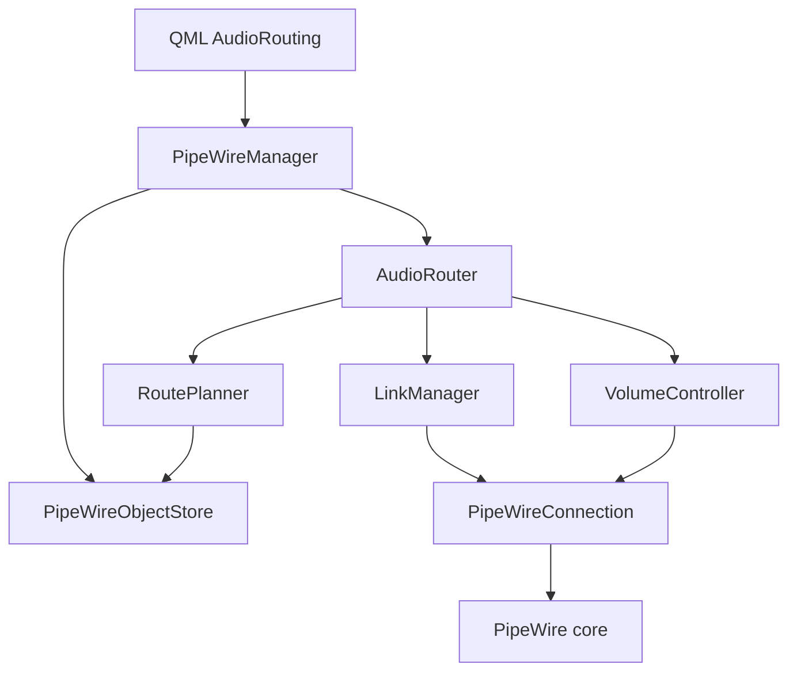

# Phase 5 — Audio Routing Engine (Cursor Implementation Plan)

Use this document in another Cursor window as the implementation plan.

Authoritative product prompt (do **not** edit it):
[`Auralis_PHASE_5_Audio_Routing_Engine_Implementation_Prompt.md`](Auralis_PHASE_5_Audio_Routing_Engine_Implementation_Prompt.md)

Do not implement Phase 6 sessions, exclusive WirePlumber hijack, DSP/sync, or `pw_stream` in production.

**Policy lock:** AdditiveRouting (create Auralis-owned links only; never destroy WirePlumber/other links). Recovery: RebindOnGraphReplacement while a route is logically enabled. Activation is atomic with rollback.

## Todos

- [ ] Extend PipeWireObjectStore + bind Port/Link; add thread-loop createLink/destroyOwnedLink
- [ ] Add AudioRoute/AudioSource/RoutePlanner + source classification unit tests
- [ ] Implement LinkManager + AudioRouter lifecycle, recovery, rollback, generation tokens
- [ ] Capability-aware destination/route volume and mute
- [ ] Expose router on PipeWireManager; add minimal Audio Routing QML panel
- [ ] Fake + live routing tests, docs, clean CMake/Ninja/ctest, Phase 0–4 regression

## Implementation map (Phase 4 → Phase 5)

| Prompt concept | Existing type | Phase 5 action |
|---|---|---|
| AudioEndpoint / registry / resolver | [`AudioEndpoint`](../../../include/auralis/audio/AudioEndpoint.h), [`AudioEndpointRegistry`](../../../include/auralis/audio/AudioEndpointRegistry.h), [`EndpointResolver`](../../../include/auralis/audio/EndpointResolver.h) | Reuse as destinations. Do not query BlueZ from the router. |
| PipeWireManager / connection / store | [`PipeWireManager`](../../../include/auralis/audio/PipeWireManager.h), [`PipeWireConnection`](../../../include/auralis/audio/PipeWireConnection.h), [`PipeWireObjectStore`](../../../include/auralis/audio/PipeWireObjectStore.h) | Single registry. Extend store; add link create/destroy on the existing `pw_thread_loop`. |
| Port / link records | extras_ counts only | Add `PipeWirePortInfo` / `PipeWireLinkInfo`; bind Port + Link. |
| AudioRouter | none | New domain in `auralis-audio`. |
| QML | `AppCore.audio` = `PipeWireManager` | Nested `router` QObject + list models. |
| SessionManager | Phase 1 stub | **Do not grow it.** |

Destination classifier stays sink-only. New **source** classification is separate: `Stream/Output/Audio`, `Audio/Source`, sink **monitor ports** (not monitor nodes as destinations).



## Graph extensions (required before planning)

Phase 4 discards port/link properties. Extend [`PipeWireTypes.h`](../../../include/auralis/audio/PipeWireTypes.h) / [`PipeWireObjectStore`](../../../include/auralis/audio/PipeWireObjectStore.h):

- `PipeWirePortInfo`: globalId, serial, nodeId, direction, name, alias, audioChannel, monitor, physical, terminal, control
- `PipeWireLinkInfo`: globalId, outputNode/Port, inputNode/Port, state, error

In [`PipeWireConnection.cpp`](../../../src/audio/PipeWireConnection.cpp): bind Port and Link (same user-data proxy pattern as Device/Node). Add **thread-loop-locked** APIs: `createLink(outputNode, outputPort, inputNode, inputPort, extraProps)` via `pw_core_create_object(..., "link-factory", PW_TYPE_INTERFACE_Link, ...)` using `PW_KEY_LINK_*`, and destroy **only** owned link proxies. Tag created links with `application.name=Auralis` and route id for diagnostics — ownership is still the in-process `OwnedLink` list.

Keep existing Device/Node bind + ESTALE handling. Graph mutation only on the PipeWire thread; Qt sees queued events.

## Domain + planner (testable, no PW)

New headers under `include/auralis/audio/`, sources under `src/audio/`:

- `AudioRoute` / `RouteState` / `RouteError` (structured category + detail string; no raw errno as UI text)
- `AudioSource` + `AudioSourceType`
- `ResolvedRoutePlan` (logical ids + current node/port pairs + channel)
- `RoutePlanner`: pure transform from source + destination endpoint ids + `PipeWireObjectStore` snapshot. Channel-aware (FL/FR/MONO); ignore control/MIDI; deterministic fallback when channel metadata missing; `NoCompatiblePorts` on incompatible layouts; never mutates the graph.

Source ids: `src:{serial|nodeName}:{mediaClass}` (ephemeral streams: keep nodeName + applicationName for rebind, do not persist port ids).

## AudioRouter orchestration

`AudioRouter` (QObject) owned by `PipeWireManager`. Public API matches prompt §18 (create/activate/deactivate/set source/dests/volume). One current user route is enough for UI; API still supports route ids (UUID string).

Activation: Planning → Ready → Activating → Active only when **all required owned links** are `ACTIVE` or legitimately `PAUSED`/idle (not ERROR). Timeout → rollback → Failed. Partial create → destroy all new owned links for that generation.

Graph events (existing `refreshGraph` path): if source/dest/port/owned-link removed, mark Degraded; on logical reappearance with **new** node ids, replan (never reuse stale ids). PipeWire Error/disconnect: leave Active, drop runtime proxies, replan only after `initialSyncComplete`.

Generation token per activate/deactivate so stale link callbacks cannot finish a newer op. Shutdown: stop recovery, destroy owned links if core still valid, then existing connection stop.

Do not pair/connect Bluetooth from AudioRouter.

## Volume

`VolumeController`: normalized `0.0..1.0`, clamp, mute bool. Prefer `SPA_PROP_volume` / `SPA_PROP_mute` / channel volumes via existing node proxy `pw_node_set_param`. If unsupported: `VolumeControlUnsupported`, do not fail the route. Route volume = fan-out with partial-result if one dest fails. No normalization DSP.

## Minimal UI

Add an **Audio Routing** section to [`ui/qml/Main.qml`](../../../ui/qml/Main.qml) (new `RoutePanel.qml` / `SourceRow.qml` as needed): source combo, multi-select playback endpoints from existing `audio.endpoints`, Activate/Deactivate, state + last error, route volume/mute when capable. No raw PipeWire ids in normal UI (developer diagnostics only).

Expose `AppCore.audio.router` (or equivalent Q_PROPERTY on `PipeWireManager`) plus `AudioSourceListModel` / route properties. No PipeWire C API in QML.

## Tests (hardware-independent first)

Fakes: `IPipeWireLinkBackend` / in-memory graph view (follow existing `FakePipeWireManager` style; no large mock framework).

| Target | Covers |
|---|---|
| `tst_AudioRoute` | ids, states, duplicate dests, errors |
| `tst_AudioSources` | stream / source / sink-not-source / monitor ports |
| `tst_RoutePlanner` | mono, stereo, 1→2 dests (4 pairs), reversed registry, missing channels, control ports, dest gone |
| `tst_AudioRouter` | state machine, rollback, dest/source loss, rebind to new node id, disconnect, activate/deactivate races |
| `tst_VolumeController` | clamp, mute, unsupported, partial route volume |

Live (default SKIP): `tst_AudioRoutingLiveIntegration` gated by `AURALIS_RUN_AUDIO_ROUTING_INTEGRATION=1`, optional `AURALIS_EXPECT_DEVICE_ADDRESS="AA:BB:CC:DD:EE:FF"`. Workflow: PW ready → pick source (playback stream or **test-only** low-volume `pw_stream` sine compiled into the test binary, never the app) → playback endpoint → create/activate → observe owned links → deactivate → owned links gone. Quote addresses in docs.

Register in [`tests/unit/audio/CMakeLists.txt`](../../../tests/unit/audio/CMakeLists.txt) / [`tests/integration/CMakeLists.txt`](../../../tests/integration/CMakeLists.txt) via `auralis_add_test`. Do not drop Phase 0–4 tests.

## Docs

Update [`README.md`](../../../README.md), [`docs/architecture.md`](../../architecture.md) (AudioRouter under PipeWireManager; AdditiveRouting), new [`docs/phase-5-validation.md`](../../phase-5-validation.md): source types, volume limits, live commands, known fan-out/WirePlumber limits. Mark complete only after tests pass.

## Verify

```bash
rm -rf build && cmake -S . -B build -G Ninja && cmake --build build && ctest --test-dir build --output-on-failure
```

Confirm no `pw-link`/`wpctl` in production code. SessionManager unchanged.

Live (after connect Smokin' Buds if mapping dest is used):

```bash
AURALIS_RUN_AUDIO_ROUTING_INTEGRATION=1 \
AURALIS_EXPECT_DEVICE_ADDRESS="88:08:94:9D:B4:22" \
ctest --test-dir build -R '^tst_AudioRoutingLiveIntegration$' --output-on-failure
```
